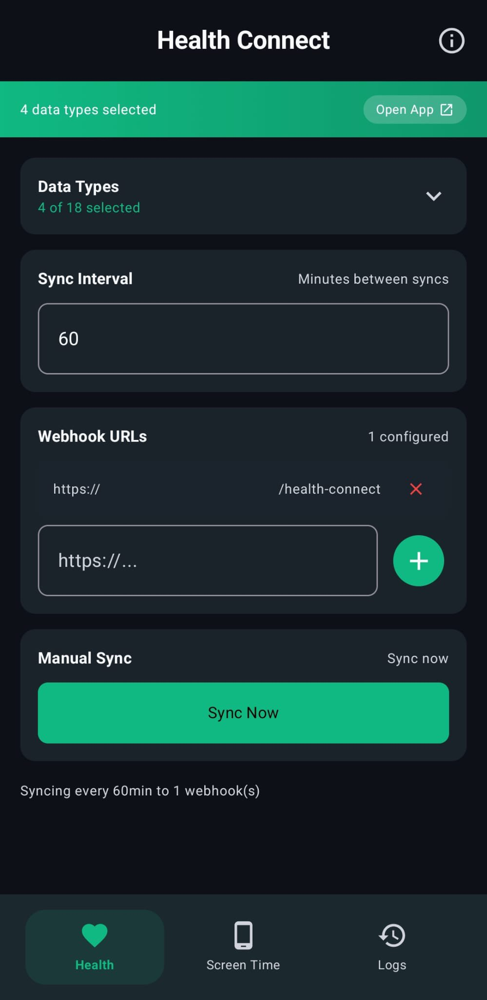
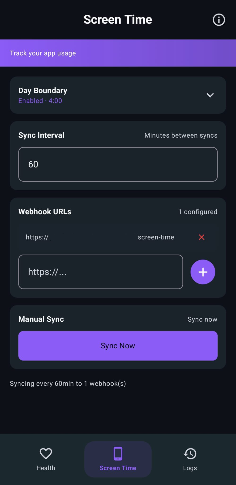
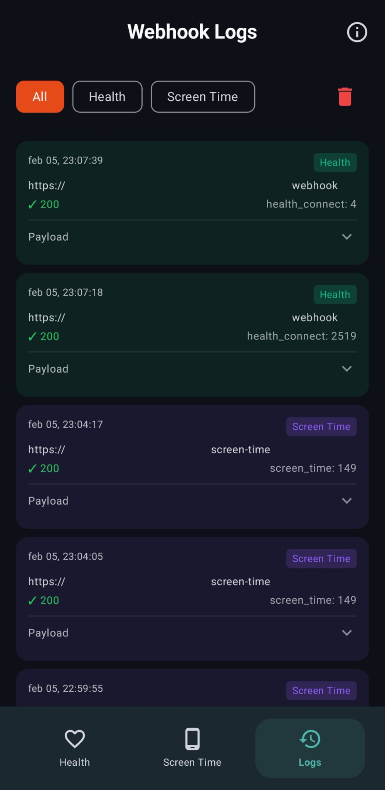

# Life Dashboard Companion

[](https://github.com/owen282000/life-dashboard-companion-app/releases/latest)
[](https://opensource.org/licenses/MIT)
[](https://developer.android.com)

<p align="center">
  
  
  
</p>

A privacy-focused Android app that syncs your **Health Connect** and **Screen Time** data to your own server via webhooks. Perfect for self-hosted dashboards, Home Assistant integrations, or any quantified self setup.

## Why This App?

- **Own Your Data** - Send health data to your own server, not third-party clouds
- **Flexible Webhooks** - Works with any backend that accepts JSON POST requests
- **Combined App** - Health Connect + Screen Time in one app
- **23 Health Data Types** - Supports all major Health Connect data types
- **Modern UI** - Built with Jetpack Compose and Material 3

## Features

### Health Connect Integration
- Syncs data from Google Health Connect to your webhook
- **23 supported data types:**
  - Activity: Steps, Distance, Active Calories, Total Calories, Exercise Sessions
  - Body: Weight, Height, Body Temperature
  - Body Composition: Body Fat %, Lean Body Mass, Bone Mass, Body Water Mass
  - Vitals: Heart Rate, Resting Heart Rate, Heart Rate Variability (HRV), Blood Pressure, Blood Glucose, Oxygen Saturation, Respiratory Rate
  - Sleep: Sleep sessions with stages
  - Nutrition: Hydration, Nutrition records
  - Mindfulness: Meditation sessions (from apps like Waking Up, Headspace)
- Per-data-type toggle and permission management
- Configurable sync interval (minimum 15 minutes)

### Screen Time Tracking
- Tracks app usage statistics via Android's UsageStatsManager
- **Configurable day boundary** - Perfect for night owls! If you set the boundary to 4 AM, any phone usage between midnight and 4 AM counts towards the previous day's total. This gives you accurate "real day" statistics instead of arbitrary midnight cutoffs.
- Syncs last 7 days of usage data
- App names resolved from package names

### Webhook Configuration
- **Multiple webhook URLs** - Send to multiple endpoints simultaneously
- **Custom headers** - Add auth tokens, API keys, or any custom HTTP headers per category
- **Separate configuration** - Different URLs and headers for Health and Screen Time

### Data Tools
- **Data preview** - View the exact JSON payload before syncing
- **Export as CSV/JSON** - Export sync logs via the Android share sheet
- **Sync history dashboard** - Overview of success rates, record counts, and recent failures

### General
- **Background sync** - Uses WorkManager for reliable background execution
- **Webhook logs** - View recent sync attempts with payloads for debugging
- **Health Connect install check** - Clear guidance when Health Connect is missing or outdated
- **Modern UI** - Material 3 design with dark mode support

## Requirements

- Android 14+ (API 34)
- [Health Connect](https://play.google.com/store/apps/details?id=com.google.android.apps.healthdata) app installed
- Usage access permission (for Screen Time feature)

## Installation

### From Releases (Recommended)
1. Download the latest APK from [Releases](https://github.com/owen282000/life-dashboard-companion-app/releases/latest)
2. Install on your Android device (enable "Install from unknown sources" if needed)

### Build from Source
```bash
# Clone the repository
git clone https://github.com/owen282000/life-dashboard-companion-app.git
cd life-dashboard-companion-app

# Build debug APK
./gradlew assembleDebug

# The APK will be at: app/build/outputs/apk/debug/app-debug.apk

# Or install directly on connected device
./gradlew installDebug
```

## Setup

1. **Install the app** on your Android device
2. **Grant Health Connect permissions** - Tap "Grant" and select the data types you want to sync
3. **Grant Usage Access** (for Screen Time) - Go to Settings when prompted
4. **Configure webhook URLs** - Enter your server endpoint(s)
5. **Add webhook headers** (optional) - Configure auth tokens or API keys
6. **Set sync intervals** - Minimum 15 minutes
7. **Tap "Preview Data"** to inspect the payload, then **"Sync Now"** to send

## Webhook Payload Format

### Health Connect
```json
{
  "timestamp": "2025-02-05T12:00:00Z",
  "app_version": "1.0",
  "source": "health_connect",
  "steps": [
    {
      "count": 1234,
      "start_time": "2025-02-05T08:00:00Z",
      "end_time": "2025-02-05T09:00:00Z"
    }
  ],
  "sleep": [
    {
      "session_end_time": "2025-02-05T07:30:00Z",
      "duration_seconds": 28800,
      "stages": [
        {
          "stage": "STAGE_TYPE_DEEP",
          "start_time": "2025-02-04T23:00:00Z",
          "end_time": "2025-02-05T01:00:00Z",
          "duration_seconds": 7200
        }
      ]
    }
  ],
  "heart_rate": [
    {
      "bpm": 72,
      "time": "2025-02-05T10:30:00Z"
    }
  ]
}
```

### Screen Time
```json
{
  "timestamp": "2025-02-05T12:00:00Z",
  "app_version": "1.0",
  "device": "Google Pixel 8",
  "source": "screen_time",
  "screen_time": [
    {
      "date": "2025-02-05",
      "total_screen_time_minutes": 180,
      "apps": [
        {
          "package": "com.instagram.android",
          "name": "Instagram",
          "minutes": 45,
          "last_used": "2025-02-05T11:30:00Z"
        }
      ]
    }
  ]
}
```

## Example Backend Integrations

### Simple Express.js Server
```javascript
const express = require('express');
const app = express();
app.use(express.json());

app.post('/api/health-connect', (req, res) => {
  console.log('Health data received:', req.body);
  // Store in database, forward to InfluxDB, etc.
  res.status(200).send('OK');
});

app.post('/api/screen-time', (req, res) => {
  console.log('Screen time data received:', req.body);
  res.status(200).send('OK');
});

app.listen(3000);
```

### Home Assistant Webhook
Use Home Assistant's webhook trigger to receive data and store it or trigger automations.

## Tech Stack

- **Kotlin** - Modern Android development
- **Jetpack Compose** - Declarative UI with Material 3
- **Health Connect SDK** - Official Google Health Connect API
- **WorkManager** - Reliable background task scheduling
- **OkHttp** - HTTP client with retry logic
- **Kotlinx Serialization** - JSON serialization

## Privacy

This app:
- Does **not** collect any data itself
- Does **not** send data anywhere except your configured webhook URLs
- Does **not** include any analytics or tracking
- Stores settings locally on your device only

You are in full control of where your data goes.

## Contributing

Contributions are welcome! Please feel free to submit a Pull Request.

1. Fork the repository
2. Create your feature branch (`git checkout -b feature/amazing-feature`)
3. Commit your changes (`git commit -m 'Add amazing feature'`)
4. Push to the branch (`git push origin feature/amazing-feature`)
5. Open a Pull Request

## License

This project is licensed under the MIT License - see the [LICENSE](LICENSE) file for details.

## Acknowledgments

- [Google Health Connect](https://developer.android.com/health-and-fitness/guides/health-connect) for the excellent SDK
- [HC Webhook](https://github.com/mcnaveen/health-connect-webhook) by mcnaveen for inspiration on Health Connect integration patterns
- The Quantified Self community for inspiration
- [Claude Code](https://claude.ai/claude-code) for assistance with development

## Support

If you find this project useful, please consider:
- Starring the repository
- Sharing it with others who might benefit
- Contributing improvements

---

Made by [Owen Vogelaar](https://github.com/owen282000) for the self-hosted and quantified self community.
