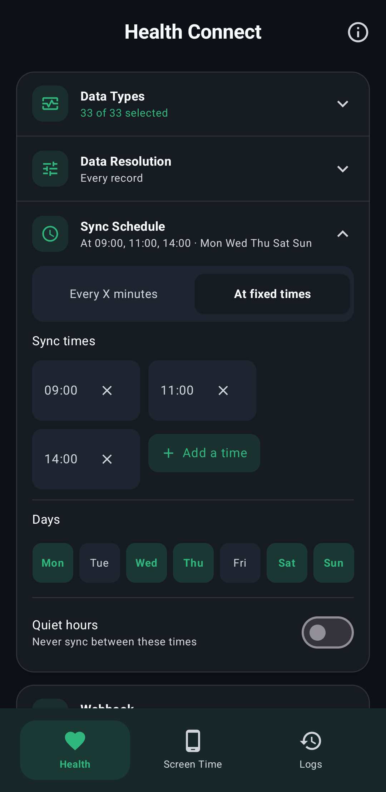
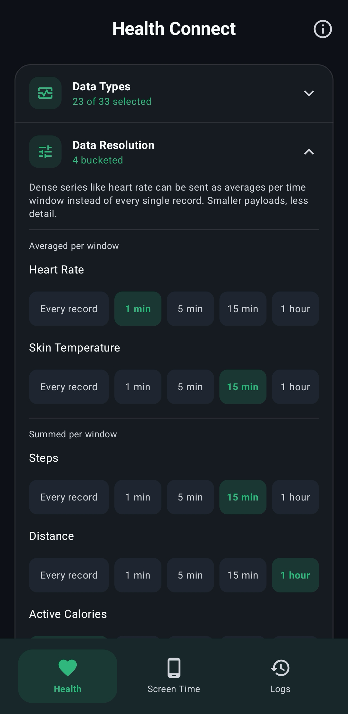
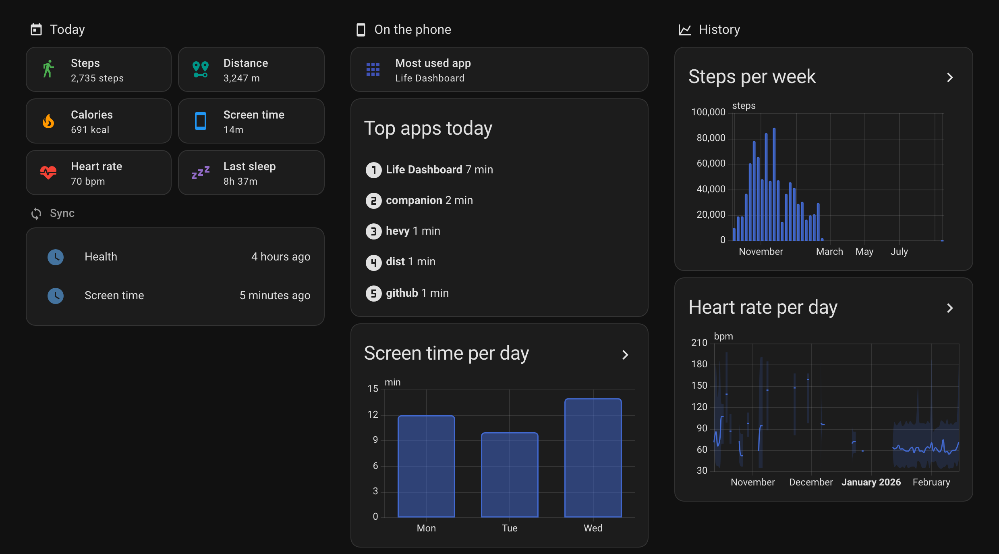

<p align="center">
  
</p>

<h1 align="center">Life Dashboard Companion</h1>

<p align="center">
  <a href="https://github.com/owen282000/life-dashboard-companion-app/releases/latest"></a>
  <a href="https://github.com/owen282000/life-dashboard-companion-app/actions/workflows/build.yml"></a>
  <a href="https://github.com/owen282000/life-dashboard-companion-app/actions/workflows/security.yml"></a>
  <a href="https://github.com/owen282000/life-dashboard-companion-app/actions/workflows/release.yml"></a>
  <br>
  <a href="https://scorecard.dev/viewer/?uri=github.com/owen282000/life-dashboard-companion-app"></a>
  <a href="https://www.bestpractices.dev/projects/14258"></a>
  <a href="https://opensource.org/licenses/MIT"></a>
  <a href="https://developer.android.com"></a>
</p>

<p align="center">
  <a href="https://github.com/owen282000/life-dashboard-companion-app/releases/latest"><b>Download the APK</b></a>
  &nbsp;·&nbsp;
  <a href="docs/usage.md">Setup guide</a>
  &nbsp;·&nbsp;
  <a href="docs/webhook.md">Payload reference</a>
  &nbsp;·&nbsp;
  <a href="https://github.com/owen282000/life-dashboard-companion-app-ios">iOS version</a>
</p>

| Health Connect | Screen Time | Sync schedule | Data resolution | Delivery logs |
|:--:|:--:|:--:|:--:|:--:|
|  |  |  |  |  |
| 33 data types, per-type toggles, incremental sync | Foreground time per app, with a custom day boundary | An interval, or times you choose, with quiet hours | Dense series as averages or totals per window | Every delivery logged, payloads inspectable |


## Why this app?

- **Own your data** - health data goes to your own server, not a third-party cloud
- **Flexible delivery** - any backend that accepts a JSON POST, or MQTT with Home Assistant Discovery
- **Combined** - Health Connect and Screen Time in one app
- **33 health data types** - all major Health Connect types, per-type toggles
- **Modern UI** - Jetpack Compose and Material 3, with dark mode

Also on iPhone? [Life Dashboard Companion for iOS](https://github.com/owen282000/life-dashboard-companion-app-ios) sends a compatible payload from Apple Health (HealthKit), so both apps can feed the same backend.

Already using the Home Assistant companion app's health sensors? [See how this compares](docs/features.md#how-this-compares-to-the-home-assistant-companion-app): 33 types instead of 25, full history instead of 30 days, and screen time, which no other tool exports.

## Quick start

1. Install the latest APK from [Releases](https://github.com/owen282000/life-dashboard-companion-app/releases/latest)
2. Grant Health Connect permissions and, for Screen Time, Usage Access
3. Enter your webhook URL (or point the app at your MQTT broker)
4. Tap **Preview Data** to inspect the payload, then **Sync Now**

The full walkthrough, requirements and troubleshooting are in [docs/usage.md](docs/usage.md).

No backend yet? [life-dashboard-stack](https://github.com/owen282000/life-dashboard-stack) is a docker-compose with an HMAC-verifying receiver, Postgres and a provisioned Grafana dashboard: from phone to Grafana in 10 minutes.

## Home Assistant

Two ways in, and neither needs YAML.

**The Life Dashboard integration** receives the app's webhook directly, so no broker is
needed at all, and pairing is a QR code the integration shows: point the phone's camera
at it, or use the scan button in the app, and the address and the signing secret fill
themselves in. It is also the way that keeps history: every day the app sends lands in
Home Assistant's long-term statistics on its own date, so a year of backfill shows up as a
year of steps, sleep, heart rate and screen time per day, and the integration ships a
dashboard to start from.

[](https://my.home-assistant.io/redirect/hacs_repository/?owner=owen282000&repository=life-dashboard-ha&category=integration)

<p align="center">
  
</p>

**MQTT** is the other way, for a setup that already runs a broker and only needs the
latest values. Point the app at the MQTT broker Home Assistant already uses and tap
**Sync Now**. MQTT Discovery creates one device with a sensor for every synced type that
has a value: 24 of the 33 Health Connect types (today's totals for steps, distance and
calories; the latest heart rate, weight, sleep duration, blood pressure, glucose, body
composition and so on) plus screen time. Workouts, meals, mindfulness sessions and cycle
tracking are events rather than values and stay webhook-only. No YAML, no server-side
setup; states are retained, so they survive a restart.

The two-minute walkthrough is in [docs/usage.md](docs/usage.md#phone-to-home-assistant-in-two-minutes); [docs/features.md](docs/features.md#home-assistant-and-mqtt) lists every sensor.

## What it sends

```json
{
  "timestamp": "2025-02-05T12:00:00Z",
  "app_version": "1.2.0",
  "source": "health_connect",
  "steps": [
    {
      "count": 1234,
      "start_time": "2025-02-05T08:00:00Z",
      "end_time": "2025-02-05T09:00:00Z",
      "source": "com.zepp.app"
    }
  ],
  "daily_totals": [
    { "date": "2025-02-05", "steps": 8421, "distance_meters": 6210.4 }
  ]
}
```

Every record carries a `uuid` for deduplication and a `source` package name. Use `daily_totals` for day totals, the raw records for detail. [docs/webhook.md](docs/webhook.md) documents every type, and [docs/webhook-schema.json](docs/webhook-schema.json) is a machine-readable JSON Schema to validate your receiver against.

## Documentation

| Doc | Covers |
|---|---|
| [docs/features.md](docs/features.md) | Full feature list, supported data types, MQTT, automation, tech stack |
| [docs/usage.md](docs/usage.md) | Requirements, installation, setup, troubleshooting |
| [docs/webhook.md](docs/webhook.md) | Complete payload reference, delivery, retries, HMAC signing, backend examples |
| [docs/settings-backup.md](docs/settings-backup.md) | Exporting and importing your configuration between devices |
| [docs/DATA_SOURCES.md](docs/DATA_SOURCES.md) | What Fitbit, Cronometer, Health Sync, Zepp and Garmin do and do not write |
| [PRIVACY.md](PRIVACY.md) | What the app reads, stores and sends, and to whom (nobody but you) |
| [docs/building.md](docs/building.md) | Build, project layout, contributing |
| [CHANGELOG.md](CHANGELOG.md) | Release history |

## Privacy

This app does **not** collect any data itself, does **not** send data anywhere except your configured webhook URLs or MQTT broker, and contains **no** analytics or tracking. Settings stay on your device. You are in full control of where your data goes. See [PRIVACY.md](PRIVACY.md).

## Contributing

Contributions are welcome. See [CONTRIBUTING.md](CONTRIBUTING.md) for guidelines and [docs/building.md](docs/building.md) for the build and project layout.

## License

MIT - see [LICENSE](LICENSE).

## Acknowledgments

Built on the work of others:

- [Health Connect](https://developer.android.com/health-and-fitness/health-connect) by Google, the SDK this app reads from
- [OkHttp](https://github.com/lysine-dev/okhttp) for webhook delivery and [HiveMQ MQTT Client](https://github.com/hivemq/hivemq-mqtt-client) for the Home Assistant integration
- [Jetpack Compose, WorkManager and Glance](https://developer.android.com/jetpack) for the UI, background sync and home screen widget
- [HC Webhook](https://github.com/mcnaveen/health-connect-webhook) by mcnaveen, for early inspiration on Health Connect integration patterns
- Everyone who has filed an issue with a payload dump or a source-app quirk; most of [docs/DATA_SOURCES.md](docs/DATA_SOURCES.md) comes from those reports
- The quantified self and self-hosting communities
- [Claude Code](https://claude.com/claude-code) for assistance with development

## Getting help

[docs/usage.md](docs/usage.md) covers setup and the questions that come up most, [Discussions](https://github.com/owen282000/life-dashboard-companion-app/discussions) is the place to ask, and [SUPPORT.md](.github/SUPPORT.md) explains when something belongs in an issue instead.

## Sponsoring

If you find this project useful, consider starring the repository, sharing it, or contributing improvements. [Buying me a coffee on Ko-fi](https://ko-fi.com/owen282000) helps keep releases and bug hunts quick - the app stays free and open source either way.

---

<p align="center">
  Made by <a href="https://github.com/owen282000">Owen Vogelaar</a> for the self-hosted and quantified self community.
</p>
