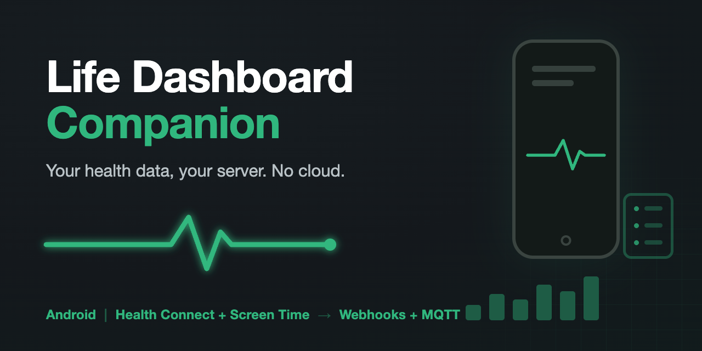
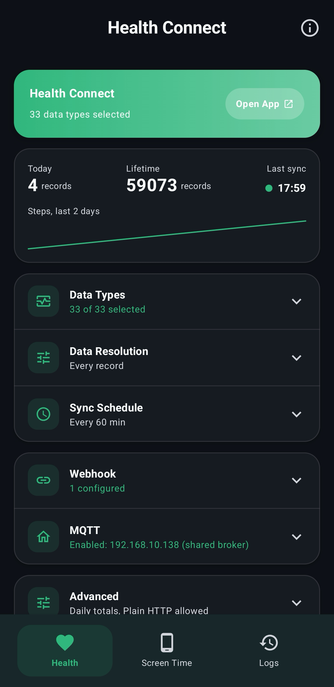
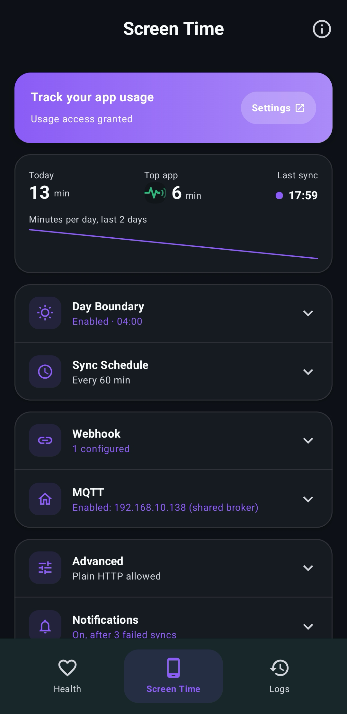
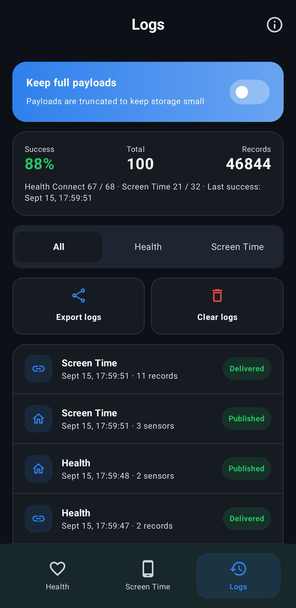

<p align="center">
  
</p>

<h1 align="center">Life Dashboard Companion</h1>

<p align="center">
  A privacy-focused Android app that syncs your <b>Health Connect</b> and <b>Screen Time</b> data to your own server via webhooks or MQTT.<br>
  Built for self-hosted dashboards, Home Assistant, and any quantified self setup.
</p>

<p align="center">
  <a href="https://github.com/owen282000/life-dashboard-companion-app/releases/latest"></a>
  <a href="https://github.com/owen282000/life-dashboard-companion-app/actions/workflows/build.yml"></a>
  <a href="https://github.com/owen282000/life-dashboard-companion-app/actions/workflows/security.yml"></a>
  <a href="https://github.com/owen282000/life-dashboard-companion-app/actions/workflows/release.yml"></a>
  <br>
  <a href="https://scorecard.dev/viewer/?uri=github.com/owen282000/life-dashboard-companion-app"></a>
  <a href="https://www.bestpractices.dev/projects/14258"></a>
  <a href="https://opensource.org/licenses/MIT"></a>
  <a href="https://developer.android.com"></a>
</p>

<p align="center">
  <a href="https://github.com/owen282000/life-dashboard-companion-app/releases/latest"><b>Download the APK</b></a>
  &nbsp;·&nbsp;
  <a href="docs/usage.md">Setup guide</a>
  &nbsp;·&nbsp;
  <a href="docs/webhook.md">Payload reference</a>
  &nbsp;·&nbsp;
  <a href="https://github.com/owen282000/life-dashboard-companion-app-ios">iOS version</a>
</p>

<p align="center">
  
  
  
</p>

## Why this app?

- **Own your data** - health data goes to your own server, not a third-party cloud
- **Flexible delivery** - any backend that accepts a JSON POST, or MQTT with Home Assistant Discovery
- **Combined** - Health Connect and Screen Time in one app
- **33 health data types** - all major Health Connect types, per-type toggles
- **Modern UI** - Jetpack Compose and Material 3, with dark mode

Also on iPhone? [Life Dashboard Companion for iOS](https://github.com/owen282000/life-dashboard-companion-app-ios) sends a compatible payload from Apple Health (HealthKit), so both apps can feed the same backend.

## Quick start

1. Install the latest APK from [Releases](https://github.com/owen282000/life-dashboard-companion-app/releases/latest)
2. Grant Health Connect permissions and, for Screen Time, Usage Access
3. Enter your webhook URL (or point the app at your MQTT broker)
4. Tap **Preview Data** to inspect the payload, then **Sync Now**

The full walkthrough, requirements and troubleshooting are in [docs/usage.md](docs/usage.md).

No backend yet? [life-dashboard-stack](https://github.com/owen282000/life-dashboard-stack) is a docker-compose with an HMAC-verifying receiver, Postgres and a provisioned Grafana dashboard: from phone to Grafana in 10 minutes.

## What it sends

```json
{
  "timestamp": "2025-02-05T12:00:00Z",
  "app_version": "1.2.0",
  "source": "health_connect",
  "steps": [
    { "count": 1234, "start_time": "2025-02-05T08:00:00Z", "end_time": "2025-02-05T09:00:00Z", "source": "com.zepp.app" }
  ],
  "daily_totals": [
    { "date": "2025-02-05", "steps": 8421, "distance_meters": 6210.4 }
  ]
}
```

Every record carries a `uuid` for deduplication and a `source` package name. Use `daily_totals` for day totals, the raw records for detail. [docs/webhook.md](docs/webhook.md) documents every type, and [docs/webhook-schema.json](docs/webhook-schema.json) is a machine-readable JSON Schema to validate your receiver against.

## Documentation

| Doc | Covers |
|---|---|
| [docs/features.md](docs/features.md) | Full feature list, supported data types, MQTT, automation, tech stack |
| [docs/usage.md](docs/usage.md) | Requirements, installation, setup, troubleshooting |
| [docs/webhook.md](docs/webhook.md) | Complete payload reference, delivery, retries, HMAC signing, backend examples |
| [docs/DATA_SOURCES.md](docs/DATA_SOURCES.md) | What Fitbit, Cronometer, Health Sync, Zepp and Garmin do and do not write |
| [docs/building.md](docs/building.md) | Build, project layout, contributing |
| [CHANGELOG.md](CHANGELOG.md) | Release history |

## Privacy

This app does **not** collect any data itself, does **not** send data anywhere except your configured webhook URLs or MQTT broker, and contains **no** analytics or tracking. Settings stay on your device. You are in full control of where your data goes. See [PRIVACY_POLICY.md](PRIVACY_POLICY.md).

## Contributing

Contributions are welcome. See [CONTRIBUTING.md](CONTRIBUTING.md) for guidelines and [docs/building.md](docs/building.md) for the build and project layout.

## License

MIT - see [LICENSE](LICENSE).

## Acknowledgments

- [Google Health Connect](https://developer.android.com/health-and-fitness/guides/health-connect) for the excellent SDK
- [HC Webhook](https://github.com/mcnaveen/health-connect-webhook) by mcnaveen for inspiration on Health Connect integration patterns
- The Quantified Self community for inspiration
- [Claude Code](https://claude.ai/claude-code) for assistance with development

## Support

If you find this project useful, consider starring the repository, sharing it, or contributing improvements. [Buying me a coffee on Ko-fi](https://ko-fi.com/owen282000) helps keep releases and bug hunts quick - the app stays free and open source either way.

---

<p align="center">
  Made by <a href="https://github.com/owen282000">Owen Vogelaar</a> for the self-hosted and quantified self community.
</p>
