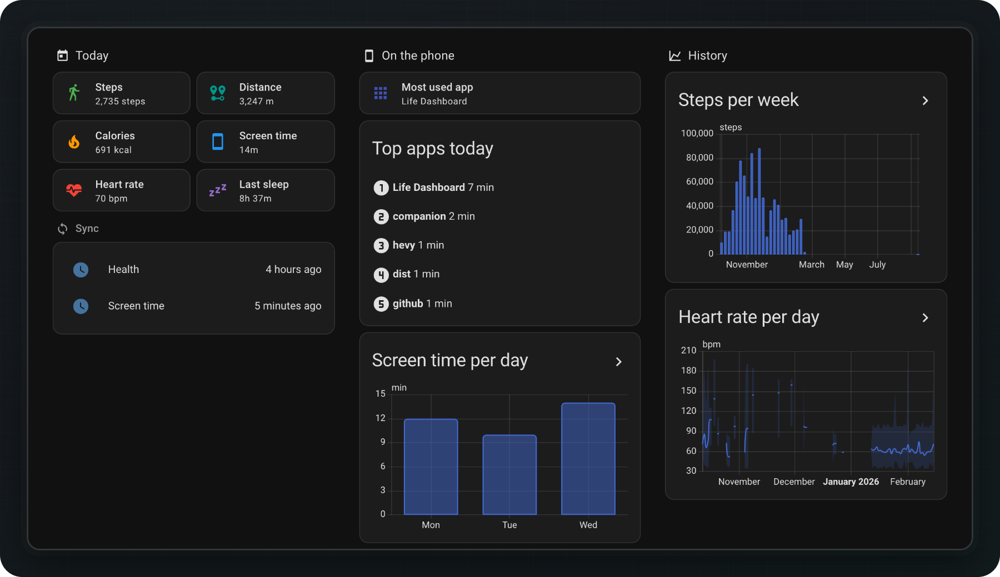
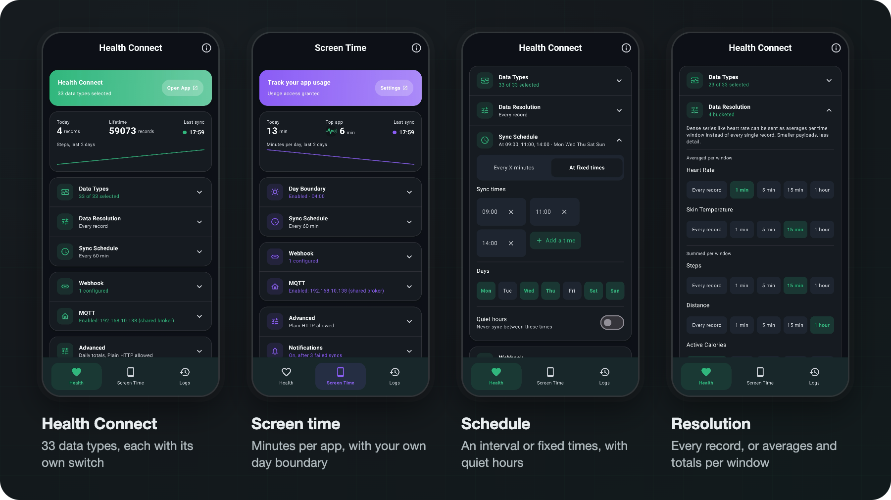
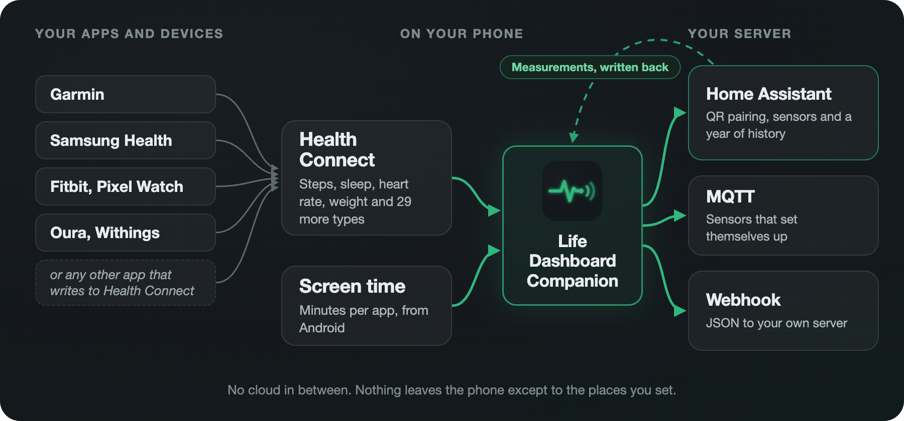
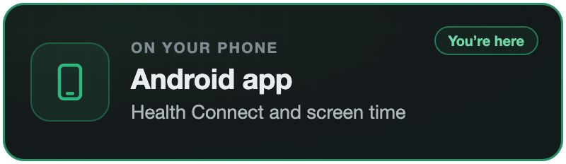
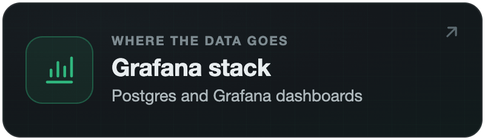

<p align="center">
  
</p>

<h1 align="center">Life Dashboard Companion</h1>

<p align="center">
  <b>Health Connect and screen time from your Android phone, sent to Home Assistant, MQTT or your own server.</b><br>
  No cloud in between, no account, no tracking.
</p>

<p align="center">
  <a href="https://github.com/owen282000/life-dashboard-companion-app/releases/latest"></a>
  <a href="https://my.home-assistant.io/redirect/hacs_repository/?owner=owen282000&repository=life-dashboard-ha&category=integration"></a>
  <a href="#install"></a>
  <a href="https://www.bestpractices.dev/projects/14258"></a>
  <a href="LICENSE"></a>
</p>

<p align="center">
  <a href="#install"><b>Install</b></a>
  &nbsp;·&nbsp;
  <a href="docs/usage.md">Setup&nbsp;guide</a>
  &nbsp;·&nbsp;
  <a href="docs/brands/README.md">Brand&nbsp;guides</a>
  &nbsp;·&nbsp;
  <a href="docs/webhook.md">Payload&nbsp;reference</a>
  &nbsp;·&nbsp;
  <a href="https://github.com/owen282000/life-dashboard-companion-app-ios">iPhone&nbsp;version</a>
</p>

<p align="center">
  <picture>
    <source media="(max-width: 600px)" srcset="docs/readme-hero-phone.png">
    
  </picture>
</p>

Your watch, ring or scale already writes to Health Connect. This app reads that data, plus how long you spend in each app, and sends both to a server you run. In Home Assistant you get sensors for today and a year of history in long-term statistics. Over MQTT, sensors set themselves up. A webhook gets every record as JSON, signed if you set a secret, to store and graph however you like.

<a id="why-this-app"></a>

## What you get

- **33 Health Connect types.** Steps, sleep with stages, heart rate and HRV, weight and body composition, blood pressure, glucose, workouts, nutrition, cycle tracking and more. Each type has its own switch.
- **Every record, plus clean daily totals.** Every raw record goes out with the app that wrote it. Daily totals for steps, distance and calories come from Health Connect itself, so a walk recorded by both phone and watch counts once.
- **A year of history.** Backfill 30, 90 or 365 days in one go. In Home Assistant each day lands on its own date.
- **Screen time per app.** Foreground minutes for every app, with a day boundary you choose (say 04:00 for late nights) and a filter to leave apps out.
- **Back into Health Connect.** With **Receive** on, readings from a scale or blood pressure monitor in Home Assistant go into Health Connect. Samsung Health and Google Health pick up the weight and body fat from there. This needs the Life Dashboard integration.
- **Runs on its own.** An interval or fixed times, on the days you pick, with quiet hours, and nothing running in between. If your server is down or only reachable at home, payloads wait on the phone for the next sync that gets through.

Recipes to start from: a [bedtime reminder from your next alarm](docs/recipes/alarm-and-sleep.md), [screen time limits](docs/recipes/screen-time-limits.md), a [Bluetooth scale into Samsung Health](docs/recipes/scale-to-health-connect.md), and [asking a local LLM about your own history](docs/recipes/ask-your-own-llm.md).

<p align="center">
  <picture>
    <source media="(max-width: 600px)" srcset="docs/readme-screens-phone.png">
    
  </picture>
</p>

## How it works

Health Connect is the place on Android where fitness apps keep their data. Garmin Connect, Samsung Health, Fitbit, Oura, Withings and Gadgetbridge all write to it. This app reads from it on a schedule and sends the new records straight to the places you set up.

<p align="center">
  <picture>
    <source media="(max-width: 600px)" srcset="docs/how-it-works-phone.png">
    
  </picture>
</p>

Not sure your watch is covered? The [brand guides](docs/brands/README.md) show what each one actually writes, and what it keeps to itself.

## Part of Life Dashboard

Life Dashboard is four projects, and you only install the parts you need. Put the app on each phone, then pick where the data goes. Both apps send the same payload, so an Android phone and an iPhone can share one Home Assistant or one stack.

<p align="center">
  <picture></picture>
  <a href="https://github.com/owen282000/life-dashboard-companion-app-ios"></a>
  <a href="https://github.com/owen282000/life-dashboard-ha"></a>
  <a href="https://github.com/owen282000/life-dashboard-stack"></a>
</p>

The data can also go to an MQTT broker or a webhook of your own instead. Both apps have that built in, for n8n, Node-RED or a script.

## Install

<p align="center">
  <a href="https://github.com/owen282000/life-dashboard-companion-app/releases/latest"></a>
  <a href="https://apps.obtainium.imranr.dev/redirect?r=obtainium://add/https://github.com/owen282000/life-dashboard-companion-app"></a>
</p>

The APK on GitHub is signed, each release carries build provenance you can [verify](SECURITY.md#verifying-a-release), and the build is [reproducible](docs/building.md#reproduce-a-release-build). Obtainium installs the same APK and keeps it updated. The F&#8209;Droid listing is in review, and a Google Play version comes later.

Screen time works on Android 8.0 and newer. The health part needs Android 9 or newer with [Health Connect](https://developer.android.com/health-and-fitness/health-connect), which is built into Android 14 and later and comes from Google Play on Android 9 through 13.

## Quick start

1. In Home Assistant (2026.3 or newer, with [HACS](https://hacs.xyz/docs/use/) installed), add the [Life Dashboard integration](https://my.home-assistant.io/redirect/hacs_repository/?owner=owen282000&repository=life-dashboard-ha&category=integration) as a custom repository, download it, restart, and add the integration. It shows a QR code. Skip this step if you use MQTT or a webhook.
2. Install the app and open it. Its setup asks where your data should go: scan the code, or enter your broker or webhook URL.
3. Grant the Health Connect permissions on the **Health** tab, and usage access on the **Screen Time** tab if you want screen time.
4. Tap **Sync Now**. Tap **View** first if you want to preview the payload.

The [setup guide](docs/usage.md) walks through each step, including battery settings that keep Android from stopping the sync and what to do when nothing arrives.

## Home Assistant

There are two ways in. Neither needs YAML.

| | Life Dashboard integration | MQTT |
|---|---|---|
| Setup | HACS, then scan a QR code | Enter your broker |
| Sensors | 24 of 33 types, plus screen time in total and per app | The same, without the sensors per app |
| History | Every day, up to a year back, through backfill | From the first sync on |
| Workouts and mindfulness | Minutes per day | No |
| **Receive** into Health Connect | Yes | No |
| Example dashboard | Included | No |

Pick the integration unless you already run a broker and don't need the days before your first sync. Single meals, cycle tracking entries and workout details are events rather than values, so neither route turns them into sensors. A webhook of your own gets them in full. [Setup for both](docs/usage.md#phone-to-home-assistant) is in the guide, and [features.md](docs/features.md#home-assistant-and-mqtt) lists what each one creates.

[](https://my.home-assistant.io/redirect/hacs_repository/?owner=owen282000&repository=life-dashboard-ha&category=integration)

<a id="why-is-this-not-part-of-the-companion-app"></a>

<details>
<summary><b>Already use the Home Assistant companion app?</b></summary>

<br>

Keep it. It does presence, notifications and device sensors, and this app doesn't try to. They work side by side.

The companion app also has Health Connect sensors, but with a different goal. Its [documentation](https://companion.home-assistant.io/docs/core/sensors) says "only the last 30 days of data is used", and each type becomes a sensor showing the latest value. Writing into Health Connect needs extra permissions that Google reviews, and the companion app hasn't added it yet ([#6799](https://github.com/home-assistant/android/pull/6799), [#5650](https://github.com/home-assistant/android/issues/5650)). For screen time it has a last used app sensor, but no time per app.

This app covers the health side in depth: 33 types instead of 25, full history in long-term statistics, writing back into Health Connect, and screen time per app. The [full comparison](docs/features.md#how-this-compares-to-the-home-assistant-companion-app) goes row by row.

</details>

<a id="what-it-sends"></a>

## Webhooks

Any server that accepts a JSON POST can be a destination: n8n, Node-RED, a small script, or your own API. Payloads are signed with HMAC-SHA256 if you set a secret, and you can add custom headers or a client certificate.

```json
{
  "timestamp": "2026-10-04T12:00:00Z",
  "app_version": "1.23.0",
  "source": "health_connect",
  "sequence": 1842,
  "daily_totals": [
    {
      "date": "2026-10-04",
      "steps": 8421,
      "distance_meters": 6210.4
    }
  ],
  "steps": [
    {
      "count": 1234,
      "start_time": "2026-10-04T08:00:00Z",
      "end_time": "2026-10-04T09:00:00Z",
      "uuid": "3f1c2a9e-7b4d-4e8a-9c61-0d2b5e7f8a10",
      "source": "com.garmin.android.apps.connectmobile"
    }
  ]
}
```

This example is shortened. Every raw record has a `uuid` to deduplicate on and a `source` that names the app that wrote it. The [payload reference](docs/webhook.md) documents every type and has a minimal receiver to start from, plus [notes for n8n and Node-RED](docs/webhook.md#n8n-and-node-red). The [JSON Schema](docs/webhook-schema.json) lets you validate what your receiver gets.

If you have no backend yet, [life-dashboard-stack](https://github.com/owen282000/life-dashboard-stack) is an example Docker Compose setup: a receiver that checks the signature, Postgres, and a Grafana dashboard. Treat it as a starting point rather than a finished product.

## Privacy

The app has no analytics, no crash reporting and no ads, and there is no Life Dashboard server. Your data goes from the phone to the destinations you configure and nowhere else. Webhooks use HTTPS unless you switch on **Allow plain HTTP webhooks**, for example for a Home Assistant server on your home network. Secrets are encrypted on the phone with a key from the Android Keystore. [PRIVACY.md](PRIVACY.md) lists every permission and every field that can leave the phone.

## Documentation

**Get started:** [Setup guide](docs/usage.md) · [Brand guides](docs/brands/README.md) · [Recipes](docs/recipes/README.md)

**Reference:** [All features](docs/features.md) · [Payload reference](docs/webhook.md) · [JSON Schema](docs/webhook-schema.json) · [What source apps write](docs/DATA_SOURCES.md) · [Settings backup](docs/settings-backup.md)

**Project:** [Building from source](docs/building.md) · [Contributing](CONTRIBUTING.md) · [Changelog](CHANGELOG.md) · [Privacy](PRIVACY.md) · [Security](SECURITY.md) · [AI policy](AI_POLICY.md) · [All documentation](docs/README.md)

## Help and contributing

Questions go to [Discussions](https://github.com/owen282000/life-dashboard-companion-app/discussions). Bugs go to [issues](https://github.com/owen282000/life-dashboard-companion-app/issues/new/choose); the template asks for what helps, like your phone, the source app and a log entry. [SUPPORT.md](.github/SUPPORT.md) explains which is which.

Pull requests are welcome. [CONTRIBUTING.md](CONTRIBUTING.md) covers the checks CI runs, and [building.md](docs/building.md) gets you a working build.

## Acknowledgments

- [Health Connect](https://developer.android.com/health-and-fitness/health-connect) by Google, which this app reads from and writes to
- [OkHttp](https://github.com/lysine-dev/okhttp) for webhook delivery and the [HiveMQ MQTT Client](https://github.com/hivemq/hivemq-mqtt-client) for MQTT
- [Jetpack Compose, WorkManager and Glance](https://developer.android.com/jetpack) for the interface, background sync and the home screen widget
- [HC Webhook](https://github.com/mcnaveen/health-connect-webhook) by mcnaveen, for early inspiration on Health Connect integration patterns
- Everyone who filed an issue with a payload dump or a quirk of their source app. Most of [DATA_SOURCES.md](docs/DATA_SOURCES.md) comes from those reports.
- [Claude Code](https://claude.com/claude-code), which drafted a large part of the code. Every change is reviewed and tested before it ships, and [AI_POLICY.md](AI_POLICY.md) explains how.

## Support the project

Stars, shares and good bug reports all help. This is a one-person project, but your setup doesn't depend on that person: there is no server of mine to switch off, your history lives in your own Home Assistant or database, and the code is MIT. If you want to chip in for the evenings that go into it, there is [Ko-fi](https://ko-fi.com/owen282000). The app stays free and open source either way.

MIT licensed. See [LICENSE](LICENSE).

<p align="center">
  <sub>Made by <a href="https://github.com/owen282000">Owen Vogelaar</a> for the self-hosting and quantified self crowd.</sub>
</p>
