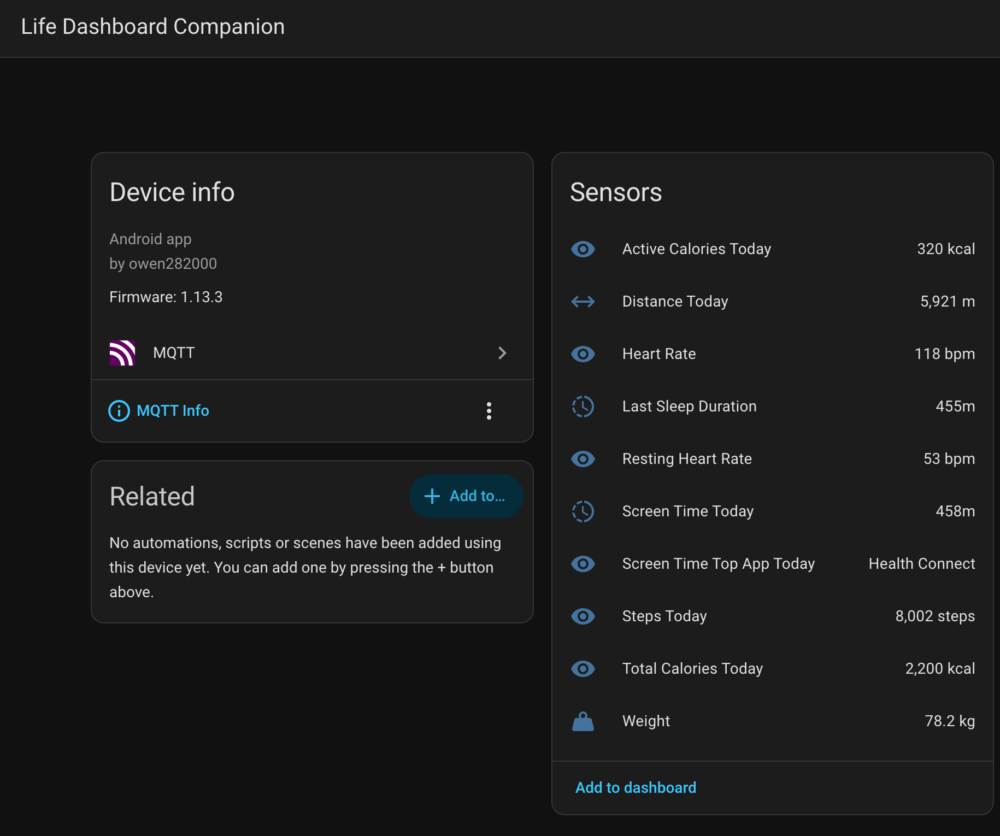

# Features

Everything Life Dashboard Companion does, in detail. For setup and day-to-day use see [usage.md](usage.md); for the payload your server receives see [webhook.md](webhook.md).

## Health Connect integration

Syncs data from Google Health Connect to your webhook, with a per-data-type toggle and permission management, and a configurable sync interval (minimum 15 minutes).

### 33 supported data types

| Category | Types |
|---|---|
| Activity | Steps, Distance, Active Calories, Total Calories, Exercise Sessions |
| Body | Weight, Height, Body Temperature, Skin Temperature, Basal Body Temperature |
| Body composition | Body Fat %, Lean Body Mass, Bone Mass, Body Water Mass |
| Vitals | Heart Rate, Resting Heart Rate, Heart Rate Variability (HRV), Blood Pressure, Blood Glucose, Oxygen Saturation, Respiratory Rate, Basal Metabolic Rate, VO2 Max |
| Sleep | Sleep sessions with stages |
| Nutrition | Hydration, Nutrition records |
| Mindfulness | Meditation sessions (from apps like Waking Up, Headspace) |
| Cycle tracking | Menstruation Period, Menstruation Flow, Intermenstrual Bleeding, Ovulation Test, Cervical Mucus, Sexual Activity, Basal Body Temperature |

Cycle tracking covers logged data from cycle apps that write to Health Connect, such as Clue and Flo. Samsung Health does not share cycle data with Health Connect, and predictions stay in the source app.

What individual source apps do and do not write is collected in [DATA_SOURCES.md](DATA_SOURCES.md).

## Screen Time tracking

- Tracks foreground time per app via Android's `UsageStatsManager`, with System UI and the launcher excluded so totals are comparable to Digital Wellbeing
- **Configurable day boundary** for night owls: set the boundary to 4 AM and phone usage between midnight and 4 AM counts towards the previous day, instead of an arbitrary midnight cutoff
- Syncs the last 7 days of usage data
- App names resolved from package names

## Webhook configuration

- **Multiple webhook URLs** - send to several endpoints simultaneously
- **Custom headers** - auth tokens, API keys, or any custom HTTP header, per category
- **HMAC payload signing** - optional `X-Signature` header so your server can verify the sender
- **Test ping** - send a small test payload to verify your server setup without waiting for real data
- **Retries with backoff** - transient failures are retried automatically; permanent errors fail fast
- **Separate configuration** - different URLs, headers and signing secrets for Health and Screen Time
- **HTTPS by default, plain HTTP on request** - `http://` URLs are refused unless "Allow plain HTTP webhooks" is switched on, for Home Assistant or receivers only reachable over a private LAN or VPN

Delivery details, retry rules and signature verification are described in [webhook.md](webhook.md#delivery-retries-and-signing).

## How this compares to the Home Assistant companion app

The [Home Assistant companion app](https://companion.home-assistant.io/docs/core/sensors) ships Health Connect sensors of its own, so if you run Home Assistant the fair question is why you would add this app. The short answer: the companion app gives you the latest value of 25 metrics inside Home Assistant; this app gives you every record of 33 types, wherever you want them. Verified against the companion app's documentation on 14 September 2026.

| | HA companion app | Life Dashboard Companion |
|---|---|---|
| Health Connect coverage | 25 sensors | 33 data types |
| Exercise sessions, nutrition, sleep stages, cycle tracking, mindfulness, skin temperature | Missing ([open issue](https://github.com/home-assistant/android/issues/4804)) | Supported |
| Detail | Latest value or daily aggregate per sensor | Every record, with the source app and a stable id, plus deduplicated daily totals |
| History | "Only the last 30 days of data is used" | Unlimited, with backfill of up to a year |
| Screen time | No sensor | Foreground time per app, custom day boundary |
| Destination | Your Home Assistant | Any webhook backend, plus MQTT with Home Assistant Discovery |
| Delivery | Sensor updates | HMAC-signed webhooks, retries, store-and-forward outbox, delivery logs |
| Android | 9+ on the Play build, 14+ otherwise | 8.0+ |

The two are complementary rather than rivals: keep the companion app for presence, notifications and device sensors, and add this app when you want the full health pipeline, history, or delivery to anything that is not Home Assistant.

## Home Assistant and MQTT

- **MQTT publishing with Home Assistant Discovery** - point the app at your MQTT broker and sensors appear in Home Assistant automatically, grouped under one device: today's totals for steps, distance and calories, and the latest value for heart rate, sleep duration, weight, blood pressure and the other point-in-time types. No server-side configuration needed.
- States and discovery configs are published retained, so values survive Home Assistant restarts
- Optional TLS and username/password authentication; credentials are stored encrypted on-device
- 24 of the 33 types get a sensor. Event-like types (exercise, nutrition, mindfulness, cycle tracking) remain webhook-only. Every publish carries the full set of sensors the app has mapped so far, so a new broker or a fresh Home Assistant sees the whole device after one sync
- Screen Time publishes too: today's and yesterday's total minutes and today's most used app (top five apps as attributes), under the same Home Assistant device. Health Connect and Screen Time each have their own switch and base topic and share one broker connection by default; either section can switch to its own broker.

## Data resolution

- **Per type, choose every record or one value per window** (1, 5 or 15 minutes, or hourly). Dense series are where payloads go wrong: a heart rate sample per second is 86,400 records a day
- Measured values are averaged with their minimum and maximum kept; accumulated quantities (steps, distance, calories) are summed. An average heart rate hides whether someone slept or sprinted, so the range travels with it
- Windows align to the clock and every bucket says how many samples went into it. A window still filling when a sync runs is held until it is complete, so it normally goes out once; late records for a window already sent produce a second object that merges exactly with the first
- The payload names the resolution it used per series, so a receiver does not have to be configured to match
- Everything defaults to every record: bucketing is lossy and is offered, never applied on your behalf

## Sync scheduling

- **Two modes per source** - a fixed interval (minimum 15 minutes, as before) or a list of times of day. Health Connect and Screen Time are scheduled separately, so screen time can sync hourly while health syncs at 08:00 and 21:00
- **Fixed times** suit data that arrives in batches: a watch writes the night to Health Connect when it syncs in the morning, so one sync at 08:00 puts the sleep, resting heart rate and HRV in Home Assistant before you look at it
- **Weekday filter** - any subset of days, for schedules that should stay quiet at the weekend
- **Quiet hours** - never sync between two times. An interval sync resumes at the end of the window; a fixed time inside the window is skipped rather than moved, so the app never invents a sync you did not ask for
- The row warns when a combination would never sync (no days left, no times, or every time inside the quiet hours) instead of going silent
- Schedules travel with the settings backup

## Automation

- **Home screen widget** - last sync result and records delivered today at a glance
- **Quick Settings tile** - trigger an immediate sync from the notification shade
- **Tasker / MacroDroid support** - trigger syncs with an explicit broadcast intent: `com.owen282000.lifedashboard.ACTION_SYNC`
- **Failure notifications** - local notification after repeated failed syncs, with a configurable threshold

## Data tools

- **Data preview** - view the exact JSON payload before syncing
- **Export as CSV/JSON** - export sync logs via the Android share sheet
- **Sync history dashboard** - overview of success rates, record counts and recent failures
- **Settings backup and restore** - export every webhook, header, secret, MQTT broker and toggle as a JSON file, and import it on another device. See [settings-backup.md](settings-backup.md)

## General

- **Background sync** - uses WorkManager for reliable background execution
- **Logs** - every webhook delivery and MQTT publish with status, error and payload, for debugging
- **Health Connect install check** - clear guidance when Health Connect is missing or outdated
- **Modern UI** - Material 3 design with dark mode support
- **Languages** - English, Dutch and German, following the system language

## Tech stack

- **Kotlin** - modern Android development
- **Jetpack Compose** - declarative UI with Material 3
- **Health Connect SDK** - official Google Health Connect API
- **WorkManager** - reliable background task scheduling
- **OkHttp** - HTTP client with retry logic
- **Kotlinx Serialization** - JSON serialization
