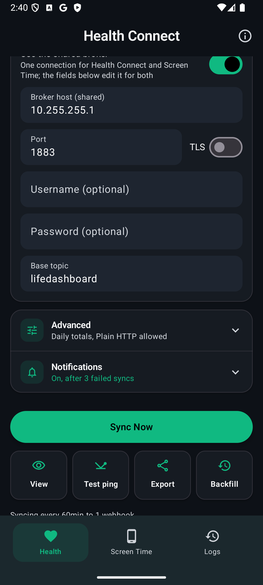
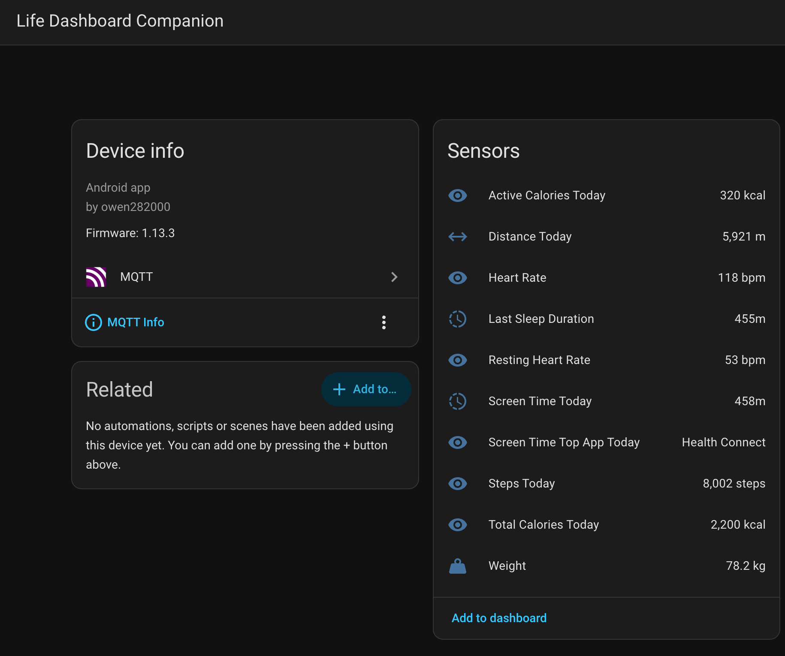
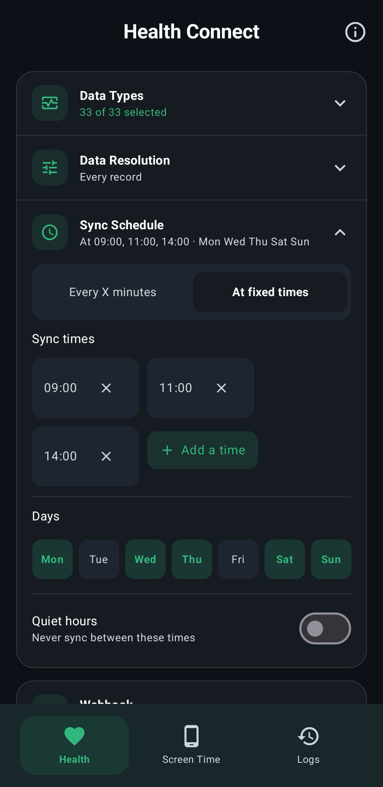
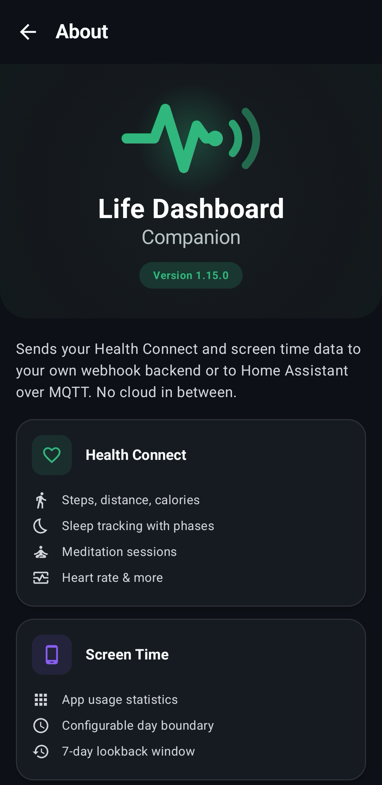

# Features

Everything Life Dashboard Companion does, in detail. For setup and day-to-day use see [usage.md](usage.md); for the payload your server receives see [webhook.md](webhook.md).

## Health Connect integration

Syncs data from Google Health Connect to your webhooks, the Home Assistant integration or MQTT, with a per-data-type toggle and permission management, and a configurable sync interval (minimum 15 minutes).

### 33 supported data types

| Category | Types |
|---|---|
| Activity | Steps, Distance, Active Calories, Total Calories, Exercise Sessions |
| Body | Weight, Height, Body Temperature, Skin Temperature, Basal Body Temperature |
| Body composition | Body Fat %, Lean Body Mass, Bone Mass, Body Water Mass |
| Vitals | Heart Rate, Resting Heart Rate, Heart Rate Variability (HRV), Blood Pressure, Blood Glucose, Oxygen Saturation, Respiratory Rate, Basal Metabolic Rate, VO2 Max |
| Sleep | Sleep sessions with stages |
| Nutrition | Hydration, Nutrition records |
| Mindfulness | Meditation sessions (from apps like Waking Up, Headspace) |
| Cycle tracking | Menstruation Period, Menstruation Flow, Intermenstrual Bleeding, Ovulation Test, Cervical Mucus, Sexual Activity, Basal Body Temperature |

Cycle tracking covers logged data from cycle apps that write to Health Connect, such as Clue and Flo. Samsung Health does not share cycle data with Health Connect, and predictions stay in the source app.

What individual source apps do and do not write is collected in [DATA_SOURCES.md](DATA_SOURCES.md).

### Backfill

**Backfill** on the Health tab sends the last 30, 90 or 365 days of every enabled type to your webhooks, in 3-day chunks, oldest first, without touching what the regular sync keeps track of. Past 30 days it needs Health Connect's history access, which the dialog asks for. It runs as a background job: it carries on when you leave the screen, the tab shows where it is when you come back, and **Stop** ends it. The app remembers the last payload that went through, also inside a busy chunk, so a backfill that Android stops or that runs out of Health Connect's read quota continues right after it by itself, and one whose delivery failed continues there when you pick the same length again within a day. After six runs in a row that sent nothing it stops and says why. Switching data types on or off while it is under way makes it start over at the first chunk, so every chunk carries the same types. The Logs tab has one row per run, with how far it got and how many records it sent; a delivery that failed has its own row. The payload fields are in [webhook.md](webhook.md#deletions).

## Screen Time tracking

- Tracks foreground time per app via Android's `UsageStatsManager`, with System UI and the launcher excluded so totals are comparable to Digital Wellbeing
- **Configurable day boundary** for night owls: set the boundary to 4 AM and phone usage between midnight and 4 AM counts towards the previous day, instead of an arbitrary midnight cutoff
- Syncs the last 7 days of usage data
- App names resolved from package names

## Webhook configuration

- **Pairing by QR code** - the [Home Assistant integration](https://github.com/owen282000/life-dashboard-ha) shows a code; the phone's camera or the scanner in the app fills in the address and the secret, after one confirmation. See [Pairing by QR code](usage.md#pairing-by-qr-code)
- **HMAC signing** with a generated secret: one tap produces 32 bytes of entropy as hex, and the same value on your server verifies every `X-Signature`
- **Multiple webhook URLs** - send to several endpoints simultaneously
- **Custom headers** - auth tokens, API keys, or any custom HTTP header, per category, sent to the URLs you typed in and never to one that QR pairing added
- **HMAC payload signing** - optional `X-Signature` header so your server can verify the sender
- **Test ping** - send a small test payload to verify your server setup without waiting for real data
- **Retries with backoff** - transient failures are retried automatically; permanent errors fail fast
- **Separate configuration** - different URLs, headers and signing secrets for Health and Screen Time
- **HTTPS by default, plain HTTP on request** - `http://` URLs are refused unless "Allow plain HTTP webhooks" is switched on, for Home Assistant or receivers only reachable over a private LAN or VPN
- **Client certificates (mTLS)** - present a certificate from Android's credential store to every webhook, for servers behind a reverse proxy that requires one

Delivery details, retry rules and signature verification are described in [webhook.md](webhook.md#delivery-retries-and-signing).

## How this compares to the Home Assistant companion app

The [Home Assistant companion app](https://companion.home-assistant.io/docs/core/sensors) ships Health Connect sensors of its own, so if you run Home Assistant the fair question is why you would add this app. The short answer: the companion app gives you the latest value of 25 metrics inside Home Assistant; this app gives you every record of 33 types, wherever you want them. Verified against the companion app's documentation on 14 September 2026.

| | HA companion app | Life Dashboard Companion |
|---|---|---|
| Health Connect coverage | 25 sensors | 33 data types |
| Exercise sessions, nutrition, sleep stages, cycle tracking, mindfulness, skin temperature | Missing ([open issue](https://github.com/home-assistant/android/issues/4804)) | Supported |
| Detail | Latest value or daily aggregate per sensor | Every record, with the source app and a stable id, plus deduplicated daily totals |
| History | "Only the last 30 days of data is used" | Unlimited, with backfill of up to a year |
| Screen time | Last used app; total screen-on time through History Stats | Foreground time per app, custom day boundary |
| Destination | Your Home Assistant | Home Assistant through the Life Dashboard integration or MQTT Discovery, and any webhook backend |
| Direction | Export only | Both: Health Connect to your server, and Home Assistant to Health Connect |
| Delivery | Sensor updates | HMAC-signed webhooks, retries, store-and-forward outbox, delivery logs |
| Android | 9+ on the Play build, 14+ otherwise | 8.0+ |

The two are complementary rather than rivals: keep the companion app for presence, notifications and device sensors, and add this app when you want the full health pipeline, history, or delivery to anything that is not Home Assistant.

## Home Assistant and MQTT

Two ways in. The [Life Dashboard integration](https://github.com/owen282000/life-dashboard-ha),
installed through HACS, is the recommended one: it receives the webhook directly and needs
no broker; it is paired by scanning a QR code, keeps history in long-term statistics (a day
per day, also for a backfill and for screen time), and comes with an example dashboard.
MQTT, described below, is the alternative: it publishes retained latest values through
Discovery and suits a setup that already has a broker and does not need the history.
Either one, not both.

- **MQTT publishing with Home Assistant Discovery** - point the app at your MQTT broker and sensors for 24 of the 33 types appear in Home Assistant automatically, grouped under one device: today's totals for steps, distance and calories, and the latest value for heart rate, sleep duration, weight, blood pressure and the other point-in-time types. No server-side configuration needed.
- States and discovery configs are published retained, so values survive Home Assistant restarts
- Optional TLS and username/password authentication; credentials are stored encrypted on-device
- The other nine are event-like types (exercise, nutrition, mindfulness, cycle tracking) and remain webhook-only. Every publish carries the full set of sensors the app has mapped so far, so a new broker or a fresh Home Assistant sees the whole device after one sync
- Screen Time publishes too: today's and yesterday's total minutes and today's most used app (top five apps as attributes), under the same Home Assistant device. Health Connect and Screen Time each have their own switch and base topic and share one broker connection by default; either section can switch to its own broker.
- **Two phones on one broker**: give each a name under Advanced > Phone name. A named phone publishes under its own device (`Life Dashboard Companion (Pixel 8)`) and its own topics (`<base>/<slug>/<key>/state`); a phone without a name publishes exactly what it always did, so a household with one phone changes nothing.

## Receiving from Home Assistant

The other direction, from 1.20.0: a scale or a blood pressure monitor that talks to Home Assistant, and not to the phone, lands in Health Connect. The **Receive** row on the Health Connect tab switches it on per type, and the [Life Dashboard integration](https://github.com/owen282000/life-dashboard-ha) (0.7.0 or later) chooses which entities go, per phone, under its options. There is no second channel and no second secret: the measurements ride back in the integration's signed answer to the webhook the app already sends, bound to that very request, so nothing between the phone and Home Assistant can slip a reading in.

- Seven types: weight, height, body fat, lean body mass, bone mass, body water mass and blood pressure. Each has its own switch and its own Health Connect write permission, asked for the moment the switch goes on and never in the bulk request; refused means off. Nothing else is declared.
- Measurements keep their own time, not the sync's, and a repeat is an upsert: the integration's id and version become Health Connect's client record id and version, so a resend changes nothing and a correction wins.
- Readings older than 30 days are refused unless "Accept older measurements" is on. The integration's "Send history to phone" button sends up to 30 days; its `life_dashboard.queue_history` service goes back up to 90, and that is where the switch matters.
- What the app writes never goes back out: those records are left out of the outgoing payload and of `deleted_records`, and counted in `_diagnostics` as `own_records_skipped`.
- When another app already writes the same type to Health Connect, the app says so when the switch goes on: a scale's own app plus Home Assistant is two readings a day.
- Every round is a row in the Logs tab, folding out to each reading with its outcome; values only when full payloads are kept.

Health Connect is the destination this app can promise; what another app shows of it is that app's choice. Checked on 26 September 2026:

| App | Reads from Health Connect |
|---|---|
| Google Health (the Fitbit app's successor) | Weight, body fat, blood glucose, exercise and nutrition; blood pressure is not in its list |
| Samsung Health | Says both directions and confirmed weight and body fat from a Withings scale through Health Connect in May 2026; community reports say body composition does not always come through, and blood pressure from third parties is unverified |
| Garmin Connect | Does not read weight from Health Connect |

The protocol is documented in [webhook.md](webhook.md#inbound-what-the-integration-may-answer). The next phase adds blood glucose, body temperature, oxygen saturation and single heart rate readings over the same channel; a generic inbound URL and an MQTT command topic, for setups without the integration, come only on request.

The setup per scale, Xiaomi, Renpho, Eufy, Withings or a cloud account, is in [recipes/scale-to-health-connect.md](recipes/scale-to-health-connect.md).

## Data resolution

- **Per type, choose every record or one value per window** (1, 5 or 15 minutes, or hourly). Dense series are where payloads go wrong: a heart rate sample per second is 86,400 records a day
- Measured values are averaged with their minimum and maximum kept; accumulated quantities (steps, distance, calories) are summed. An average heart rate hides whether someone slept or sprinted, so the range travels with it
- Windows align to the clock and every bucket says how many samples went into it. A window still filling when a sync runs is held until it is complete, so it normally goes out once; late records for a window already sent produce a second object that merges exactly with the first
- The payload names the resolution it used per series, so a receiver does not have to be configured to match
- Everything defaults to every record: bucketing is lossy and is offered, never applied on your behalf

## Sync scheduling

- **Two modes per source** - a fixed interval (minimum 15 minutes, as before) or a list of times of day. Health Connect and Screen Time are scheduled separately, so screen time can sync hourly while health syncs at 08:00 and 21:00
- **Fixed times** suit data that arrives in batches: a watch writes the night to Health Connect when it syncs in the morning, so one sync at 08:00 puts the sleep, resting heart rate and HRV in Home Assistant before you look at it
- **Weekday filter** - any subset of days, for schedules that should stay quiet at the weekend
- **Quiet hours** - never sync between two times. An interval sync resumes at the end of the window; a fixed time inside the window is skipped rather than moved, so the app never invents a sync you did not ask for
- The row warns when a combination would never sync (no days left, no times, or every time inside the quiet hours) instead of going silent
- Schedules travel with the settings backup

## Automation

- **Home screen widget** - last sync result and records delivered today at a glance
- **Quick Settings tile** - trigger an immediate sync from the notification shade. A tap within a minute of the last accepted sync from the tile or the broadcast is ignored, and on Android 10 and later the tile says "Try again in a minute"
- **Tasker / MacroDroid support** - trigger syncs with an explicit broadcast intent: `com.owen282000.lifedashboard.ACTION_SYNC`. Any app can send it, so it only starts a normal sync of what you configured, and a broadcast within a minute of the last accepted one, from the tile or a broadcast, is ignored
- **Failure notifications** - local notification after repeated failed syncs, with a configurable threshold

## Data tools

- **Data preview** - **View** on the Health and Screen Time tabs shows the exact JSON payload before syncing
- **Export as CSV/JSON** - **Export** on the Health and Screen Time tabs shares the current data, and **Export logs** on the Logs tab the delivery log, via the Android share sheet. The file stays in the app's cache until the next export replaces it, or until the app starts more than a day later; see [PRIVACY.md](../PRIVACY.md#what-stays-on-the-device)
- **Sync history dashboard** - overview of success rates, record counts and recent failures on the Logs tab
- **Settings backup and restore** - export every webhook, header, secret, MQTT broker and toggle as a JSON file, and import it on another device. See [settings-backup.md](settings-backup.md)

## General

- **Background sync** - uses WorkManager for reliable background execution
- **Logs** - every webhook delivery and MQTT publish with status, error and payload, for debugging
- **Health Connect install check** - clear guidance when Health Connect is missing or outdated
- **Modern UI** - Material 3 design with dark mode support
- **Languages** - English, Dutch and German, following the system language

## Tech stack

- **Kotlin** - modern Android development
- **Jetpack Compose** - declarative UI with Material 3
- **Health Connect SDK** - official Google Health Connect API
- **WorkManager** - reliable background task scheduling
- **OkHttp** - HTTP client with retry logic
- **Kotlinx Serialization** - JSON serialization
